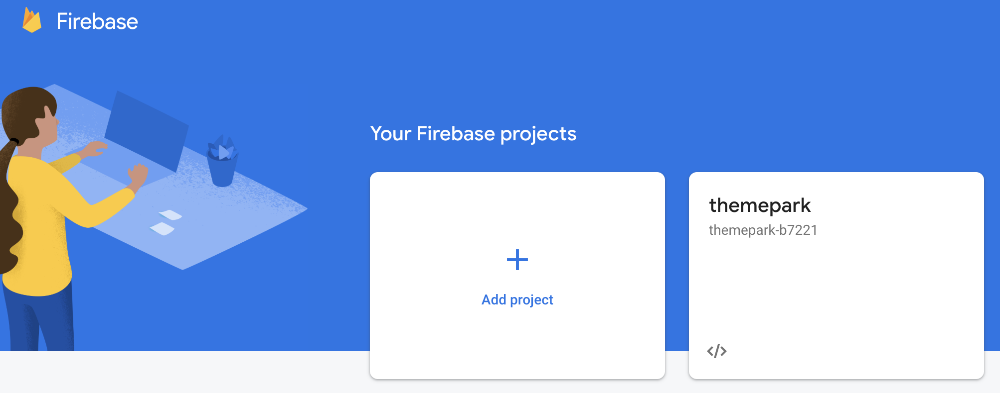
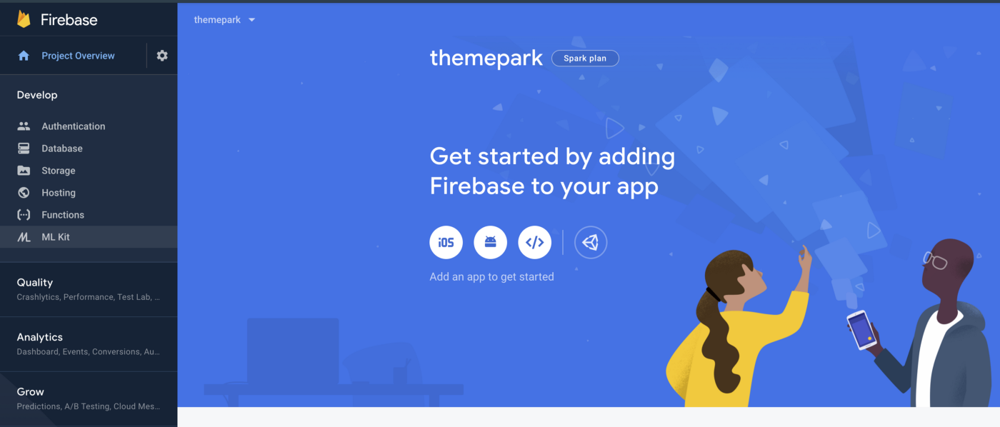

# Creating your first Firebase Project: A Step by Step Guide

Firebase is an application development platform provided by Google that focuses on enabling developers to create powerful web applications with easy to use and easy to understand tools.

If you’re not familiar with Firebase, I would strongly encourage you to check out [what they have to offer](https://firebase.google.com/) before reading through this tutorial.

## Step 0
In order to use Firebase, you will need to first set up a Google account. If you don’t have a Google account, you can set one up [here](https://accounts.google.com/signup/v2/webcreateaccount?flowName=GlifWebSignIn&flowEntry=SignUp).

## Step 1
Make sure you’re signed into your Google account, and make your way to the [Firebase homepage](https://firebase.google.com/). Once you’re there, you will click **Get Started** and be taken to the Firebase console.

*Firebase homepage as of October 2019.*

## Step 2
Now, you're inside the Firebase console. Here, you'll see a dashboard that shows your current Firebase projects, helpful links to Firebase documentation, and a link to a demo project that shows a glimpse into what a full-scale project would look like.

To continue, click **Add a new Project** under the **Firebase Projects** header.

*Firebase console as of April 2020.*

## Step 3
First, you'll be prompted to enter a name for your new project. An important thing to consider when you’re creating a Firebase project is that it can house multiple databases, authentication sources, storage buckets, and much more as explained on their [homepage](https://firebase.google.com).

For example, if you’re thinking of creating an application that stores information about pets in your local area, you could name the project **Local Pets**. Inside of it, you could house different databases for dogs, cats, lizards, etc., and have image hosting for local pet shops in the area. When in doubt, pick a descriptive name that works best for you.

## Step 4
After choosing a name, you’ll be asked whether or not you’d like to include **Google Analytics**. They offer a short explanation on the selection page, but in case you’re curious, you can find out more about Google Analytics provided by Google Marketing Platform on their [homepage](https://marketingplatform.google.com/about/analytics/).

**Congratulations!** You’ve set up your first Firebase project, and it was easy as pie. From here, the opportunities are endless. Now that you’ve got a Firebase project, a great place to start learning about what you can do with it is the [Firebase docs](https://firebase.google.com/docs). Here, you can set up a multitude of web projects in the language of your choice.

*The Firebase console inside of a newly created project as of October 2019.*

*Created October 2019. Last updated April 2020.*
